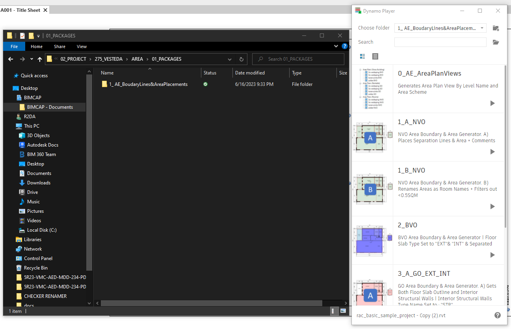

> # **BIMCAP SCRIPT ONLINE DIRECTORY**
Node Grouping | Node Naming & Description | Information Box | Updated Script Organization | Element Codes | Custom Nodes | Packages 
----------------------------------------------------------------------

> ## **NODE GROUPS**

-----------------------------------------------------------------------

> ## **INFORMATION BOX**

**CONTENTS:**

| FIELD | INFORMATION | 
| :-- | :-- |
| PROJECT | Script Name | 
| FILE CATEGORY | CODE_CATEGORY | 
| 01. General : | [CATEGORY_SCRIPT NAME]| 
| | Ex: 3D_ClashIsolate: For General Scripts|
| 02. Project : | [PROJECT CODE_CATEGORY_SCRIPT NAME]
| | Ex: 257_AE_BVO : Projects with No Acronyms | 
| | Ex: PDP_WA_WallProtection_Hor : For Projects with Acronyms
| ASSOCIATED FILES | Excel, Text, Scripts etc. |
| DESCRIPTION | Script Description | 
| ADDITIONAL COMMENTS | 
| REVIT VERSION | 
| REQUIRED DYNAMO PACKAGES | All Packages that Need to be Installed for the Script. |
| PLAYER PACKAGES | Dynamo Player Packages, When Scripts are to be Used Together in Order, They are Placed in a Package in the Folders for the End User | 
| CUSTOM PACKAGES | Any .dyf File Created for the Script | 
| AUTHORS / CREATION DATE | Script Creator & Date Created. [MOD] to be Added when Script is Modified | 

-----------------------------------------------------------------------

> ## **SCRIPT ORGANIZATION**

**1_GENERAL SCRIPTS**
*Scripts That Can be Used In Any Project*

**2_PROJECT SCRIPTS** 
*Scripts specifically made for a project* 
- **266_HILTI**: Hilti
- **268_JGC**: JGC
- **272_PDP**: PDP 
- **275_VESTEDA**: Vesteda
- **263_VMC**: Vouliagmenis Mall Complex
-----------------------------------------------------------------------
> ## **ELEMENT CODES**
Element Codes for Directory and Script Naming

----------------------------------------------------------

**Script Naming Follows :**

*Date | Main Category | Category | Description | Version*

- Example [General Script]: Clash Isolate Script for General Use
    - 20230604_GEN_3D_Clash_Isolate_V.1.0.0
- Example [Project Script]: PDP Wall Comments
    - 20230604_PDP_WA_Comments_V1.0.0

----------------------------------------------------------

| ELEMENT NAME | CODE NAMING |
| :--: | :--: |
| 3D | 3D |
| AREA | AE |
| ASSEMBLY | ASM |
| BOQ | BOQ |
| CHECKER | CH |
| COLLECTOR | COLLR |
| COLUMNS | COL |
| COORDINATES | COR |
| CREATOR | CREA |
| EXCEL | EXL |
| EXPORT | EXP |
| FAMILY | FML |
| FIXTURES | FIX |
| FLOORS | FLR |
| GRID | GR|
| LINES |  LI |
| LINKS | LNK |
| MATERIALS | MAT |
| MECHANICAL EQUIPMENT| ME |
| MEP | MEP |
| RAMP | RMP |
| RENAMER | REN |
| ROOMS | RM |
| SCHEDULES | SCH |
| STAIRS | ST |
| SUPPORTS | SUP | 
| PIPES | PI |
| WALLS | WA |
| WARNINGS | WAR |
| WORKSETS | WS |

-----------------------------------------------------------------------

> ## **CUSTOM NODES**
*For scripts with custom nodes [dyf. *Dynamo Custom Node File* ]
- Custom Nodes Are Saved In Each Script Folder: 01_PACKAGES
- File Should Be Copied to the Following File Path [Change to your PC Path]
- Check Which Version of Dynamo the Script is In. 
    - Go to Toolbar -> Dynamo -> About
- Select the Version Folder and Paste the .dyf There.
_______________

| File Path | Dynamo Version | 
| :--: | :--: |
| C:\Users\R2DA\AppData\Roaming\Dynamo\Dynamo Revit\2.6\definitions |  Check your Dynamo Version [2.6/2.10 etc.] |

-----------------------------------------------------------------------

> ## **PLAYER PACKAGES**
*When Scripts are to be Used Together in Order, They are Placed in a Package in the Folders for the End User*

- Location: Inside Each Script Folder -> 01_PACKAGES
- From Dynamo Player: Specify File from Browser Pop Up.
